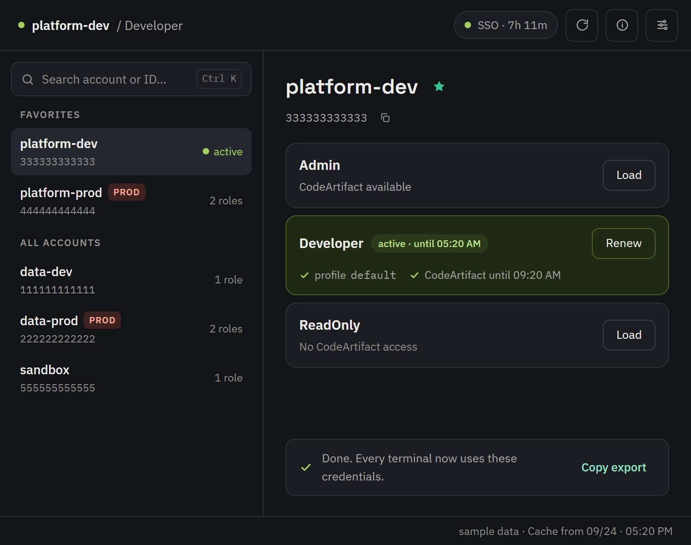

# PickRole

Sign in to **AWS IAM Identity Center** (formerly AWS SSO), pick an account and role, and get working credentials in
**every terminal and IDE**, with no `export` and no script to run per shell. If you use **CodeArtifact**, PickRole also
gets the token and updates Maven's `settings.xml`.



Runs on **Linux** (RHEL, Fedora, Ubuntu, Debian and compatible) and **Windows 10 and 11**. The interface is in English and Brazilian
Portuguese. [Leia em português](README.pt-BR.md).

## Why

Credentials from IAM Identity Center usually end up in environment variables, and environment variables live in one
shell. Open a new terminal, an IDE or a background job and you sign in again, and switching accounts means redoing it
everywhere.

PickRole writes the credentials to the files AWS tools already read on their own:

| What | Where |
| --- | --- |
| Temporary credentials | `~/.aws/credentials`, in the `default` profile or in one named profile per account and role |
| CodeArtifact token | `~/.m2/settings.xml`, only in the `<server>` entries with the configured IDs |
| SSO session | `~/.aws/sso/cache`, in the same format as the AWS CLI |

Switch accounts in PickRole and every terminal uses the new one on its next command.

## Features

- Browser sign-in with a device code, and session renewal without opening the browser again.
- Cached account list: the first start fetches everything from AWS, later starts are instant. One button refreshes it.
- **Pick up where you left off**: your last profile is one Enter away.
- Search (`Ctrl K`), favorites and recent profiles.
- Production accounts stand out, and loading a role in production asks for confirmation unless its name says it only
  reads (`ReadOnly`, `ViewOnly`, `SecurityAudit`, `Billing`).
- Warning when the session is about to expire.
- Shareable configuration: one person sets it up, exports a `.json`, and the rest of the team imports it.
- Detects an existing `sso-session` in `~/.aws/config`.
- Light and dark themes, English and Brazilian Portuguese, following the system by default.

## Install

Download from the [releases page](https://github.com/pickrole/pickrole/releases). Check the files against
`SHA256SUMS` from the same release.

### Linux

Pick the package for your distribution. Each one pulls GTK and WebKitGTK if they're missing and adds PickRole to the
application menu.

| Distribution | Package | Install |
|---|---|---|
| RHEL, AlmaLinux, Rocky Linux 8 and 9 | `pickrole_<version>_el8_x86_64.rpm` | `sudo dnf install ./pickrole_*_el8_x86_64.rpm` |
| Fedora | `pickrole_<version>_fedora_x86_64.rpm` | `sudo dnf install ./pickrole_*_fedora_x86_64.rpm` |
| Ubuntu 22.04+, Debian 12+ | `pickrole_<version>_amd64.deb` | `sudo apt install ./pickrole_*_amd64.deb` |

Other distributions can use a `.tar.gz` with just the binary: `webkit2gtk-4.1` for most current ones, `webkit2gtk-4.0`
for older ones. Every release installs each package on its target distribution and checks that the binary finds all
its libraries.

### Windows

Download `pickrole_<version>_windows_amd64.zip`, extract it and run `pickrole.exe`. It's portable: no installation and
no admin rights, and it uses the WebView2 that ships with Windows. Credentials go to `%USERPROFILE%\.aws\credentials`,
which the AWS CLI and SDKs read.

The `.exe` isn't code-signed yet, so on first run Windows may show "Windows protected your PC": choose **More info →
Run anyway**. If your organization blocks unsigned executables, ask your IT team to allow it.

### From the command line

Download, verify and install in one go. Set `version` to the tag on the [releases page](https://github.com/pickrole/pickrole/releases)
and `file` to your package from the table above:

```bash
version=v0.2.0-beta.3
file=pickrole_${version#v}_el8_x86_64.rpm

curl -LO "https://github.com/pickrole/pickrole/releases/download/${version}/${file}"
curl -LO "https://github.com/pickrole/pickrole/releases/download/${version}/SHA256SUMS"
sha256sum -c SHA256SUMS --ignore-missing
sudo dnf install "./${file}"   # apt install for a .deb
```

### With an AI assistant

An agentic coding assistant with shell access (Claude Code, Copilot CLI, and the like) can run the steps above for
you. Hand it a prompt such as:

> Install the latest PickRole release from https://github.com/pickrole/pickrole/releases for my Linux distribution
> (see the package table in its README). Download the package and `SHA256SUMS` from the same release, verify the
> checksum, then install it with my distribution's package manager. Confirm with me before running the install
> command.

### Proxy

By default PickRole finds the proxy by itself: `HTTPS_PROXY`/`HTTP_PROXY` (and `NO_PROXY`) when set, otherwise the
system settings — on Windows the system proxy, PAC scripts included; on Linux the manual proxy from GNOME's network
settings.

If that isn't right for your network, open **Settings → Network**: choose **Manual** and enter the proxy address and
the hosts that skip it, or **No proxy**. **Test connection** checks that AWS answers with the settings on screen,
before you save them, and shows which proxy was used.

Not supported: a PAC script on Linux (use **Manual**), a user and password in the proxy address (set `HTTPS_PROXY`
instead) and proxies that require NTLM or Kerberos authentication (use a local proxy that authenticates for you).

## Getting started

1. Open PickRole. If your team already uses it, choose **Import** and pick the configuration file you got. Otherwise,
   enter the SSO start URL (`https://….awsapps.com/start`) and region.
2. Authorize in the browser. PickRole shows the code so you can check it matches.
3. Pick the account and role. Done: every terminal now uses those credentials.

### Team configuration file

**Settings → Export** writes a file like this. It holds no secrets, only addresses and names:

```json
{
  "version": 1,
  "sso": { "startUrl": "https://[YOUR-ORG].awsapps.com/start", "region": "us-east-1", "sessionName": "pickrole" },
  "codeArtifact": {
    "enabled": true,
    "domain": "[DOMAIN]",
    "domainOwner": "[ACCOUNT ID]",
    "region": "us-east-1",
    "repository": "[REPOSITORY]",
    "tools": { "maven": { "enabled": true, "serverIds": ["codeartifact"], "settingsPath": "~/.m2/settings.xml" } }
  },
  "preferences": { "profileMode": "default", "theme": "system", "language": "system" }
}
```

### Maven

**Settings → CodeArtifact → Detect in settings.xml** fills in everything below from your `settings.xml`. To do it by
hand, everything comes from the CodeArtifact repository URL:

```
https://my-domain-111122223333.d.codeartifact.us-east-1.amazonaws.com/maven/releases/
        └─ domain ─┘ └─ owner ──┘                └ region ┘          └ repository ┘
```

The domain can contain hyphens; the owner account is the 12 digits after the last one.

**Server IDs** are the `<server>` entries that get the token: one per `<repository>`, `<pluginRepository>` or
`<mirror>` pointing to CodeArtifact, with the same `id`. Detection lists those, and every `<server>` whose password is
`${env.CODEARTIFACT_AUTH_TOKEN}`. PickRole only changes `<username>` and `<password>` in these entries, replacing the
variable with the token itself, so no `export` is needed. The first time it changes an existing `settings.xml`, it
keeps a copy in `settings.xml.pickrole.bak`.

For safety, `settings.xml` must be inside your home folder (no network paths, no links pointing outside it), and it's
written readable only by you, since it now holds the token.

## Documentation

- [Architecture](docs/architecture.md): components, flows, and the files PickRole reads and writes
- [Stack](docs/stack.md): technologies and why
- [Architecture decision records (ADRs)](docs/adr/README.md)
- [Design](docs/design.md): colors, brand and languages
- [Contributing](CONTRIBUTING.md): setup, testing without an AWS account, conventions, build and release
- [Security](SECURITY.md): how to report vulnerabilities, and the protections in place
- [Changelog](CHANGELOG.md)

## Roadmap

- New-version notice
- Tray icon with favorites and the active profile
- Automatic CodeArtifact token renewal before it expires
- Gradle, npm and pip
- More than one SSO organization

## License

[MIT](LICENSE)
