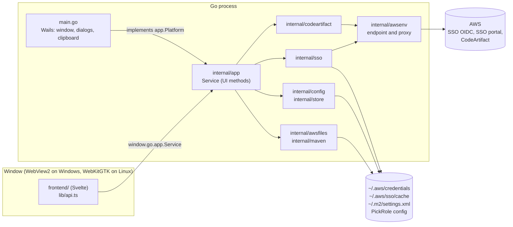
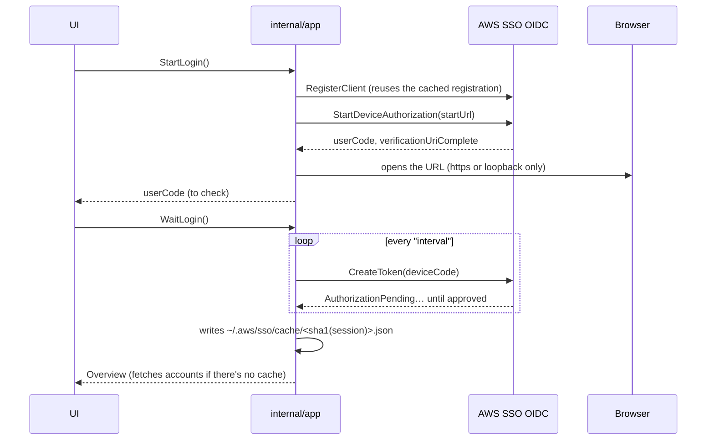
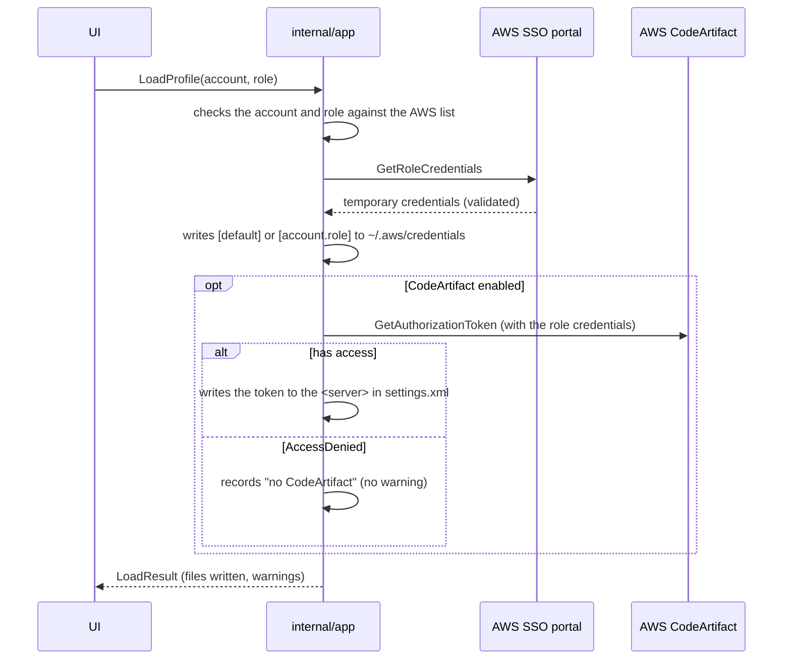

# Architecture

PickRole is a Go desktop app with an embedded web UI ([Wails v2](https://wails.io)). The backend talks to AWS and
writes files; the UI (Svelte) shows state and calls backend methods. The reasons behind each choice are in the
[ADRs](adr/README.md), and the technologies in [stack.md](stack.md).

## Components

| Package | Responsibility |
|---|---|
| `main.go` | Thin Wails layer: creates the window, bridges the UI and implements `app.Platform` (open URL, file dialogs, clipboard). |
| `internal/app` | `Service`: every method the UI calls. **Doesn't import Wails**, so it runs and is tested anywhere ([ADR 0008](adr/0008-backend-independent-of-wails.md)). |
| `internal/sso` | Device-code sign-in, renewal with the refresh token, accounts and roles (in parallel), role credentials. |
| `internal/codeartifact` | `GetAuthorizationToken`. `AccessDenied` becomes `ErrNoAccess`: not an error for the user, just "no CodeArtifact". |
| `internal/awsfiles` | Edits one section of `~/.aws/credentials`, keeping the rest ([ADR 0005](adr/0005-surgical-file-edits.md)). |
| `internal/maven` | Edits one `<server>` in `settings.xml` as text, keeping its formatting; `.pickrole.bak` backup. |
| `internal/config` | PickRole's `config.json`, validation, production-account pattern, `sso-session` detection in `~/.aws/config`. |
| `internal/store` | Account cache, recents, favorites, active profile, CodeArtifact access per role. |
| `internal/awsenv` | Client endpoint (`AWS_ENDPOINT_URL*`) and proxy: the setting in the config, the environment variables, the Windows or GNOME settings, and the connection test ([ADR 0012](adr/0012-proxy.md), [ADR 0020](adr/0020-proxy-settings-and-gnome.md)). |
| `internal/clipboard` | Copies secrets out of the Windows clipboard history ([ADR 0014](adr/0014-secrets-out-of-clipboard-history.md)). |
| `internal/i18n` | Backend messages in English and Portuguese ([ADR 0018](adr/0018-english-first-localized-ui.md)). |
| `internal/fsutil` | Atomic writes, JSON, `~/` expansion, real path (follows links and junctions). |
| `internal/fakeaws`, `cmd/fakeaws` | Fake AWS for tests ([ADR 0009](adr/0009-fake-aws-for-tests.md)). |

## UI to Go bridge

Wails exposes the public methods of `app.Service` on `window.go.app.Service`. The UI only reaches it through
`frontend/src/lib/api.ts`. Outside Wails (a plain browser, `npm run dev`), `api.ts` uses the mock in
`frontend/src/lib/mock.ts`, with sample data.

The TypeScript types in `frontend/src/lib/types.ts` mirror the Go structs by hand. The `frontend/wailsjs` that Wails
generates is neither used nor committed. When you change an exposed struct, update all three: the Go struct,
`types.ts` and the mock.

Errors reach JavaScript as strings. The ones that need a new sign-in start with `LOGIN_REQUIRED`
(`app.LoginRequired`); the UI detects them with `isLoginRequired()`, shows the sign-in and retries the pending action
afterwards.

## Languages

The UI strings live in `frontend/src/lib/i18n/` (`en.ts` is the reference; `pt-BR.ts` must have the same keys, which
TypeScript enforces). The language comes from the `language` preference, where `system` follows the OS and falls back
to English. The UI tells the backend the resolved language with `Service.SetLanguage`, so backend errors, warnings and
dialog titles match; those messages live in `internal/i18n/messages.go`, with a test that every language has every key.

## Flows

### Sign-in (device code)

The token is cached in the **AWS CLI format** ([ADR 0006](adr/0006-sso-cache-in-aws-cli-format.md)): a session
opened in PickRole works for `aws --profile` with the same `sso-session`, and the other way around. Renewal uses the
refresh token, without the browser ([ADR 0007](adr/0007-device-code-sign-in.md)).

### Loading a profile

## Files PickRole reads and writes

| File | Use | Permissions |
|---|---|---|
| `~/.aws/credentials` (or `AWS_SHARED_CREDENTIALS_FILE`) | Credentials of the loaded profile. Only the profile's section changes. | `0600` |
| `~/.aws/sso/cache/<sha1>.json` | SSO token, AWS CLI format. | `0600` |
| `~/.aws/config` (or `AWS_CONFIG_FILE`) | Read only: detects an `sso-session` on first run. | — |
| Maven `settings.xml` (default `~/.m2/settings.xml`) | CodeArtifact token in the configured `<server>`. Must be inside the home folder. | `0600` |
| `settings.xml.pickrole.bak` | Copy of the original, on the first change. | `0600` |
| OS config folder + `pickrole/config.json` | PickRole configuration. | `0600` |
| OS cache folder + `pickrole/` | Account cache, recents, favorites. | `0600` |

The config folder is `~/.config` on Linux and `%APPDATA%` on Windows; the cache folder is `~/.cache` and
`%LOCALAPPDATA%`. Every write is atomic: a temporary file in the same folder, then a `rename` over the target. The
app's About dialog shows the real paths on the machine.

## Build and distribution

| Platform | How it's built | Artifact |
|---|---|---|
| Linux, webkit2gtk-4.0 | `scripts/build-linux.sh` in an AlmaLinux 8 container ([ADR 0010](adr/0010-linux-build-on-el8.md)) | RPM for RHEL/Alma/Rocky 8 and 9, `.tar.gz` |
| Linux, webkit2gtk-4.1 | `WAILS_TAGS=webkit2_41 scripts/build-linux.sh` in an Ubuntu 22.04 container ([ADR 0019](adr/0019-second-linux-build-for-webkit2gtk-4-1.md)) | RPM for Fedora, `.deb` for Ubuntu 22.04+ and Debian 12+, `.tar.gz` |
| Windows 10 and 11 | `scripts/build-windows.ps1` ([ADR 0011](adr/0011-portable-windows-exe.md)) | `.zip` with the `.exe` |

The scripts embed the version, commit and date with `-ldflags` (`main.version`, `main.commit`, `main.buildDate`). A
`v*` tag triggers `.github/workflows/release.yml`, which builds everything, computes `SHA256SUMS` and publishes the
release with the notes from `CHANGELOG.md`. The Linux part lives in `.github/workflows/linux-packages.yml`: it packages
both builds (`scripts/package-linux.sh`) and installs each package in a container of its target distribution, failing if
the binary can't find a library.
